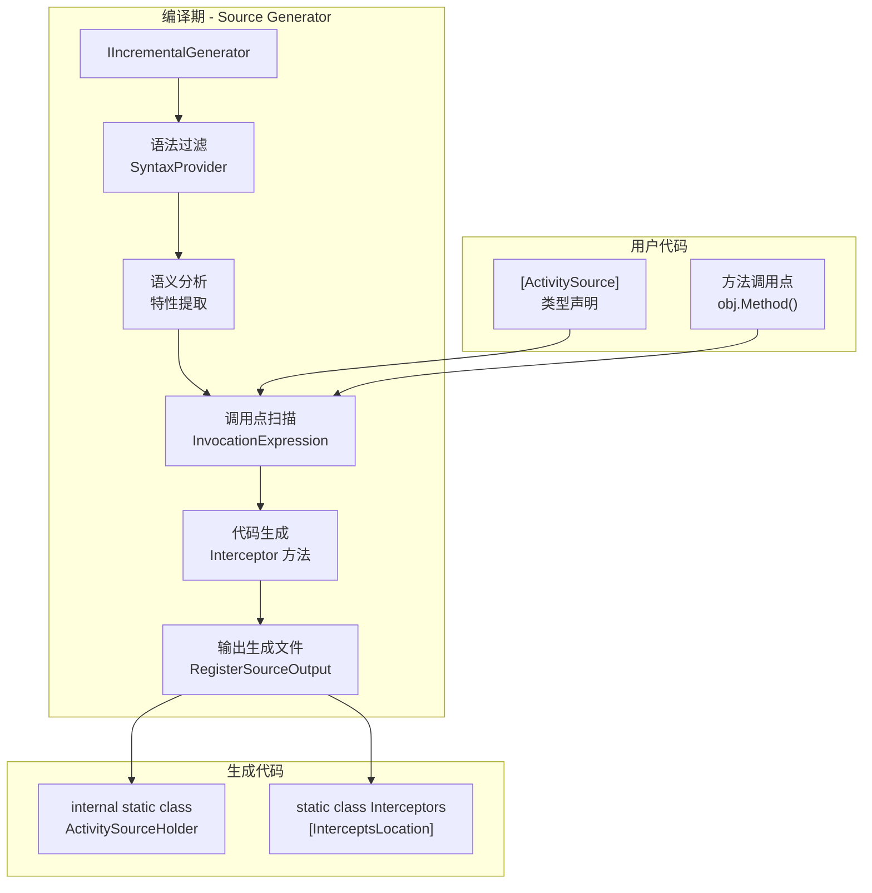
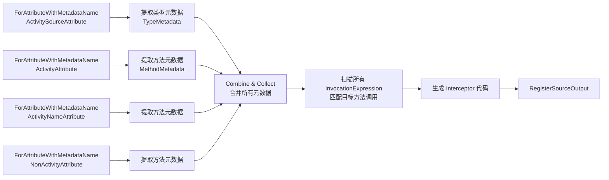

# 设计文档

## 概述

本设计将 OpenTelemetry.Proxy 从基于 Metalama `ISourceTransformer` 的编译期语法树重写方案，迁移到基于 Roslyn Incremental Source Generator + C# Interceptors 的方案。

核心变化：
- **Metalama ProxyRewriter** 直接修改用户源文件的语法树（原地重写方法体）→ **Source Generator** 生成独立的拦截代码文件，通过 `[InterceptsLocation]` 在编译期将对目标方法的调用重定向到生成的拦截方法
- **ActivitySource 字段**从目标类型的 partial class 中生成 → 在拦截代码文件中通过内部静态类集中管理
- **ProxyHasGeneratedAttribute** 完全移除（Interceptor 在调用方生成代码，被调用库不被修改）
- **VariableName 属性**从 `ActivitySourceAttribute` 和 `ActivityAttribute` 中移除（生成器内部控制命名）
- **接口方法和抽象方法**现在可以被支持（Interceptor 在调用点工作，不需要重写方法体）

## 架构

### 整体架构



### Metalama 方案 vs Interceptor 方案对比

| 维度 | Metalama (当前) | Source Generator + Interceptors (新) |
|------|----------------|--------------------------------------|
| 工作方式 | 重写目标方法的语法树 | 在调用点生成拦截方法 |
| ActivitySource 位置 | 目标类型的 private static 字段 | 生成文件中的内部静态类 |
| partial 要求 | 不需要（直接重写语法树） | 不需要（在调用方生成拦截代码） |
| 接口/抽象方法 | 不支持（无方法体可重写） | 支持（在调用点拦截） |
| 行号保持 | 通过 #line 指令 | 不需要（原方法未修改） |
| ProxyHasGenerated | 需要标记已处理的类型 | 不需要 |

### IIncrementalGenerator 管线设计



管线分为两个阶段：

1. **元数据收集阶段**：通过 `ForAttributeWithMetadataName` 高效过滤带有目标特性的类型和方法，提取为不可变的元数据模型（`TypeMetadata`、`MethodMetadata`）。此阶段利用 Incremental Generator 的缓存机制，仅在相关特性声明变化时重新计算。

2. **调用点扫描与代码生成阶段**：遍历编译中的所有 `InvocationExpressionSyntax`，通过语义模型匹配到目标方法，获取 `InterceptableLocation`，然后为每个调用点生成对应的拦截方法。

## 组件与接口

### 1. ProxySourceGenerator（入口）

```csharp
[Generator(LanguageNames.CSharp)]
public class ProxySourceGenerator : IIncrementalGenerator
{
    public void Initialize(IncrementalGeneratorInitializationContext context)
    {
        // 1. 收集带 [ActivitySource] 的类型
        var typeProvider = context.SyntaxProvider
            .ForAttributeWithMetadataName(
                "OpenTelemetry.Proxy.ActivitySourceAttribute",
                predicate: (node, _) => node is TypeDeclarationSyntax,
                transform: (ctx, ct) => ExtractTypeMetadata(ctx, ct));

        // 2. 收集带 [Activity] 的方法
        var activityMethodProvider = context.SyntaxProvider
            .ForAttributeWithMetadataName(
                "OpenTelemetry.Proxy.ActivityAttribute",
                predicate: (node, _) => node is MethodDeclarationSyntax,
                transform: (ctx, ct) => ExtractActivityMethodMetadata(ctx, ct));

        // 3. 收集带 [ActivityName] 的方法和类型
        var activityNameProvider = context.SyntaxProvider
            .ForAttributeWithMetadataName(
                "OpenTelemetry.Proxy.ActivityNameAttribute",
                predicate: (node, _) => node is MethodDeclarationSyntax or TypeDeclarationSyntax,
                transform: (ctx, ct) => ExtractActivityNameMetadata(ctx, ct));

        // 4. 收集带 [NonActivity] 的方法
        var nonActivityProvider = context.SyntaxProvider
            .ForAttributeWithMetadataName(
                "OpenTelemetry.Proxy.NonActivityAttribute",
                predicate: (node, _) => node is MethodDeclarationSyntax,
                transform: (ctx, ct) => ExtractNonActivityMetadata(ctx, ct));

        // 5. 合并元数据，扫描调用点，生成代码
        var combined = typeProvider.Collect()
            .Combine(activityMethodProvider.Collect())
            .Combine(activityNameProvider.Collect())
            .Combine(nonActivityProvider.Collect());

        context.RegisterSourceOutput(
            combined.Combine(context.CompilationProvider),
            (spc, source) => Execute(spc, source));
    }
}
```

### 2. MetadataExtractor（元数据提取）

负责从语法和语义模型中提取特性配置，复用现有 `ProxyVisitor` 的分析逻辑：

- `ExtractTypeMetadata`：提取 `[ActivitySource]` 的 ActivitySourceName、Kind、IncludeNonAsyncStateMachineMethod、SuppressInstrumentation
- `ExtractActivityMethodMetadata`：提取 `[Activity]` 的 ActivityName、Kind、SuppressInstrumentation
- `ExtractActivityNameMetadata`：提取 `[ActivityName]` 的 ActivityName、AdjustStartTime
- `ExtractNonActivityMetadata`：提取 `[NonActivity]` 的 SuppressInstrumentation
- `ExtractTagMetadata`：提取 `[ActivityTag]` 和 `[ActivityTags]` 的 Tag 配置

### 3. CallSiteScanner（调用点扫描）

遍历编译中所有语法树，查找对目标方法的调用（`InvocationExpressionSyntax`），通过 `SemanticModel.GetSymbolInfo()` 匹配到已收集的目标方法，然后使用 `SemanticModel.GetInterceptableLocation()` 获取拦截位置信息。

```csharp
internal static class CallSiteScanner
{
    public static ImmutableArray<InterceptCallSite> ScanCallSites(
        Compilation compilation,
        ImmutableArray<TargetMethodInfo> targetMethods,
        CancellationToken ct)
    {
        var results = ImmutableArray.CreateBuilder<InterceptCallSite>();

        foreach (var tree in compilation.SyntaxTrees)
        {
            var semanticModel = compilation.GetSemanticModel(tree);
            var root = tree.GetRoot(ct);

            foreach (var invocation in root.DescendantNodes().OfType<InvocationExpressionSyntax>())
            {
                ct.ThrowIfCancellationRequested();

                var symbolInfo = semanticModel.GetSymbolInfo(invocation, ct);
                if (symbolInfo.Symbol is not IMethodSymbol methodSymbol) continue;

                // 匹配目标方法
                var target = FindTargetMethod(methodSymbol, targetMethods);
                if (target == null) continue;

                // 获取拦截位置
                var location = semanticModel.GetInterceptableLocation(invocation, ct);
                if (location == null) continue;

                results.Add(new InterceptCallSite(target, location, invocation, methodSymbol));
            }
        }

        return results.ToImmutable();
    }
}
```

### 4. InterceptorEmitter（代码发射）

根据方法模式（Activity / ActivityName / SuppressInstrumentation）生成对应的拦截方法代码。

### 5. DiagnosticReporter（诊断报告）

复用现有的诊断 ID：
- `OTSP001`：无法识别的特性参数表达式
- `OTSP002`：特性参数值为 null
- `OTSP003`：特性参数类型不匹配

## 数据模型

### 元数据模型（不可变，用于 Incremental Generator 缓存）

```csharp
/// 类型级别元数据
internal readonly record struct TypeMetadata(
    string TypeFullName,
    string ActivitySourceName,
    string Kind,
    bool IncludeNonAsyncStateMachineMethod,
    bool SuppressInstrumentation,
    EquatableArray<TagMetadata> TypeTags,
    EquatableArray<MemberInfo> Members,        // 字段和属性信息
    EquatableArray<MethodInfo> Methods);        // 类型中的方法信息

/// 方法级别元数据
internal readonly record struct MethodMetadata(
    string ContainingTypeFullName,
    string MethodName,
    string MethodSymbolKey,                     // 用于匹配调用点
    MethodMode Mode,                            // Activity / ActivityName / SuppressInstrumentation
    string? ActivityName,
    string? Kind,
    bool SuppressInstrumentation,
    bool AdjustStartTime,
    bool IsStatic,
    bool IsVoid,
    bool IsAsync,
    EquatableArray<TagMetadata> InTags,
    EquatableArray<TagMetadata> OutTags,
    EquatableArray<ParameterInfo> Parameters,
    ReturnTypeInfo ReturnType);

/// Tag 元数据
internal readonly record struct TagMetadata(
    string TagName,
    string SourceName,
    TagSource Source,                           // Parameter / ReturnValue / InstanceField / StaticField
    string? Expression);

/// 调用点信息
internal readonly record struct InterceptCallSite(
    MethodMetadata Target,
    InterceptableLocation Location,
    IMethodSymbol ResolvedMethod);

/// 方法模式枚举
internal enum MethodMode
{
    Activity,
    ActivityName,
    SuppressInstrumentation
}

/// Tag 来源枚举
internal enum TagSource
{
    Parameter,
    ReturnValue,
    InstanceFieldOrProperty,
    StaticFieldOrProperty
}
```

### 生成代码结构

每个编译单元生成一个文件，按目标类型拆分为多个 `file static class`，避免跨类方法名冲突：

```csharp
// <auto-generated/>
#nullable enable

namespace OpenTelemetry.Proxy.Generated
{
    // ActivitySource 实例集中管理 + 注册扩展方法
    public static class ActivitySourceHolder
    {
        internal static readonly System.Diagnostics.ActivitySource
            ActivitySource_MyNamespace_MyClass =
                new("MyNamespace.MyClass",
                    typeof(MyNamespace.MyClass).Assembly.GetName().Version?.ToString());

        // 按 ActivitySourceName 去重，相同名称只生成一个

        /// <summary>Register all generated ActivitySource instances.</summary>
        public static TracerProviderBuilder Add{AssemblyName}Sources(
            this TracerProviderBuilder builder)
        {
            builder.AddSource("MyNamespace.MyClass");
            return builder;
        }
    }

    // 每个目标类型一个 file static class，方法名无需类型前缀
    file static class Interceptors_MyNamespace_MyClass
    {
        [StackTraceHidden]
        [InterceptsLocation(1, "...call site 1...")]
        [InterceptsLocation(1, "...call site 2...")]  // 同一方法多处调用合并
        internal static void MyMethod_Intercept_0(this MyNamespace.MyClass @this, int param)
        {
            // ... Activity 逻辑 ...
        }
    }

    file static class Interceptors_MyNamespace_MyStaticClass
    {
        [StackTraceHidden]
        [InterceptsLocation(1, "...")]
        internal static void StaticMethod_Intercept_0(int param)
        {
            // ...
        }
    }
}
```

### 功能特性

- **DisableProxyGenerator**：在项目中设置 `<DisableProxyGenerator>true</DisableProxyGenerator>` 可禁用代理代码生成
- **ActivitySource 注册**：`ActivitySourceHolder` 生成 `Add{AssemblyName}Sources()` 扩展方法，一次性注册所有 ActivitySource，方法名包含程序集名称避免跨项目冲突

### Interceptor 方法签名规则

拦截方法必须与被拦截方法签名兼容：
- **实例方法**：拦截方法为 `static` 扩展方法，第一个参数为 `this T @this`
- **静态方法**：拦截方法也为 `static` 方法，参数列表完全匹配
- **方法命名**：`{MethodName}_Intercept_{index}`，每个目标类型独立的 `file static class` 天然隔离命名空间
- **泛型方法**：拦截方法的泛型参数数量 = 包含类型的泛型参数数量之和 + 方法自身的泛型参数数量
- **ref/out/in 参数**：保持相同的 ref kind
- **返回类型**：必须完全匹配
- **多调用点**：同一目标方法的多个调用点通过叠加多个 `[InterceptsLocation]` 属性合并到一个拦截方法
- **StackTraceHidden**：所有生成的拦截方法标注 `[StackTraceHidden]`，异常堆栈中不会出现拦截方法

### 三种拦截模式的代码生成模板

#### Activity 模式

```csharp
[StackTraceHidden]
[InterceptsLocation(1, "...")]
[InterceptsLocation(1, "...")]  // 多个调用点
internal static ReturnType MethodName_Intercept_N(this T @this, params...)
{
    var activity = ActivitySourceHolder.Source_XXX.StartActivity("ActivityName", kind);
    // ... InTags, try-catch-finally, OutTags ...
}
```

#### ActivityName 模式

```csharp
[StackTraceHidden]
[InterceptsLocation(1, "...")]
internal static ReturnType MethodName_Intercept_N(this T @this, params...)
{
    using (InnerActivityAccessor.SetActivityContext(new InnerActivityContext
    {
        AdjustStartTime = true/false,
        Name = "ActivityName",
        Tags = new Dictionary<string, object?> { { "tag", value } }
    }))
    {
        return @this.OriginalMethod(args...);
    }
}
```

#### SuppressInstrumentation 模式

```csharp
[StackTraceHidden]
[InterceptsLocation(1, "...")]
internal static ReturnType MethodName_Intercept_N(this T @this, params...)
{
    using (SuppressInstrumentationScope.Begin())
    {
        return @this.OriginalMethod(args...);
    }
}
```

### Tag 值表达式解析

Tag 值的解析逻辑与现有实现保持一致：

| Tag 来源 | 表达式 | 示例 |
|----------|--------|------|
| 方法参数 | `paramName` | `delay` |
| 返回值 | 捕获返回值到局部变量 | `var @return = original(); activity.SetTag("$returnvalue", @return);` |
| 实例字段/属性 | `@this.FieldName` | `@this.Now` |
| 静态字段/属性 | `TypeName.FieldName` | `MyClass.Now` |
| 带 Expression | `source + expression[1..]` | `param.Property`（Expression="$.Property"） |
| ref 参数 | 同时作为 InTag 和 OutTag | 入口和出口各设置一次 |
| out 参数 | 仅作为 OutTag | 仅在返回前设置 |

### IncludeNonAsyncStateMachineMethod 判断逻辑

`IncludeNonAsyncStateMachineMethod = false`（默认）时，仅检查方法是否有 `async` 关键字修饰符，不检查返回类型。这与当前 Metalama 实现的行为一致（`SyntaxExtensions.IsAsync()` 检查 `method.Modifiers.HasModifier("async")`）。

### 泛型处理

- **泛型类型**：ActivitySource 名称使用开放泛型类型名（如 `MyClass`1`），与现有 `GetTypeName(0)` 行为一致
- **泛型方法拦截**：拦截方法的泛型参数数量 = 包含类型泛型参数 + 方法泛型参数，类型约束从原方法复制
- **InterceptsLocation**：Roslyn 的 `GetInterceptableLocation` API 自动处理泛型调用的位置编码

### NuGet 打包

```xml
<Project Sdk="Microsoft.NET.Sdk">
  <PropertyGroup>
    <TargetFramework>netstandard2.0</TargetFramework>
    <EnforceExtendedAnalyzerRules>true</EnforceExtendedAnalyzerRules>
    <IsRoslynComponent>true</IsRoslynComponent>
  </PropertyGroup>

  <ItemGroup>
    <PackageReference Include="Microsoft.CodeAnalysis.CSharp" Version="4.14.0" PrivateAssets="all" />
    <!-- 4.14.0 对应 .NET 10 SDK，GetInterceptableLocation API 在此版本为正式 API -->
  </ItemGroup>

  <!-- 打包为 Analyzer -->
  <ItemGroup>
    <None Include="$(OutputPath)\$(AssemblyName).dll"
          Pack="true"
          PackagePath="analyzers/dotnet/cs"
          Visible="false" />
  </ItemGroup>
</Project>
```

C# 14 中 Interceptors 是正式特性，消费方项目无需额外配置即可使用。


## 正确性属性

*正确性属性是一种在系统所有有效执行中都应成立的特征或行为——本质上是对系统应做什么的形式化陈述。属性是人类可读规范与机器可验证正确性保证之间的桥梁。*

以下属性基于需求文档中的验收标准，经过可测试性分析和冗余消除后得出。

### Property 1: 特性元数据提取正确性

*For any* 带有 `[ActivitySource]`、`[Activity]`、`[ActivityName]`、`[ActivityTag]` 或 `[ActivityTags]` 特性的有效类型或方法声明，元数据提取器提取的配置值（ActivitySourceName、Kind、IncludeNonAsyncStateMachineMethod、SuppressInstrumentation、ActivityName、AdjustStartTime、Tag Name、Tag Expression）应与特性参数中指定的值完全一致。

**Validates: Requirements 2.1, 2.2, 2.3, 2.4, 2.5**

### Property 2: Activity 模式拦截代码结构完整性

*For any* 标注了 `[Activity]` 的方法，生成的拦截方法应包含：(a) 通过 `ActivitySource.StartActivity()` 创建 Activity 的调用（包含正确的 ActivityName 和 Kind），(b) `try-catch-finally` 块结构，(c) catch 块中的 `ActivityExtensions.SetExceptionStatus()` 调用和重新抛出，(d) finally 块中的 `Activity.Dispose()` 调用。

**Validates: Requirements 3.1, 3.2, 3.4, 3.5, 3.6, 3.10**

### Property 3: Tag 设置代码生成正确性

*For any* 带有 InTags 或 OutTags 的 Activity 模式方法，生成的拦截代码应在方法入口处为每个 InTag 生成 `activity.SetTag()` 调用，并在方法返回前为每个 OutTag 生成 `activity.SetTag()` 调用，且 Tag 名称和值表达式与元数据一致。

**Validates: Requirements 3.3, 3.8**

### Property 4: SuppressInstrumentation 条件生成

*For any* `SuppressInstrumentation = true` 的 Activity 模式方法，生成的拦截代码应包含 `SuppressInstrumentationScope.Begin()` 调用和对应的 finally 块中的 `Dispose()` 调用；当 `SuppressInstrumentation = false` 时，不应包含这些调用。

**Validates: Requirements 3.7**

### Property 5: ActivityName 模式拦截代码结构完整性

*For any* 标注了 `[ActivityName]` 的方法，生成的拦截方法应包含 `using(InnerActivityAccessor.SetActivityContext(...))` 包装，且 `InnerActivityContext` 中的 Name、AdjustStartTime 和 Tags 属性值与元数据一致。

**Validates: Requirements 4.1, 4.2, 4.3, 4.4**

### Property 6: SuppressInstrumentation 模式拦截代码结构

*For any* 标注了 `[NonActivity(true)]` 的方法，生成的拦截方法应包含 `using(SuppressInstrumentationScope.Begin())` 包装原方法调用。

**Validates: Requirements 5.1**

### Property 7: ActivitySource 字段生成正确性

*For any* 标注了 `[ActivitySource]` 的类型或隐式需要 ActivitySource 的类型（方法标注了 `[Activity]` 但类型未标注 `[ActivitySource]`），生成的代码应包含一个 `static readonly ActivitySource` 字段，其构造函数参数为正确的 ActivitySourceName 和 `typeof(T).Assembly.GetName().Version?.ToString()`。

**Validates: Requirements 6.2, 6.3, 6.5**

### Property 8: ActivitySource 去重

*For any* 一组具有相同 ActivitySourceName 的类型，在同一编译输出中应只生成一个 ActivitySource 字段实例。

**Validates: Requirements 6.6**

### Property 9: Tag 来源解析正确性

*For any* Tag 配置，Tag 值表达式应根据来源类型正确生成：参数 → `paramName`，实例字段/属性 → `@this.MemberName`，静态字段/属性 → `TypeName.MemberName`，返回值 → 捕获到局部变量；当指定了 Expression 属性时，表达式应正确附加到来源值上。

**Validates: Requirements 7.1, 7.2, 7.3, 7.4, 7.5**

### Property 10: 方法过滤规则正确性

*For any* 标注了 `[ActivitySource]` 的类型，当 `IncludeNonAsyncStateMachineMethod = false` 时，仅 `async` 修饰符方法和显式标注了 `[Activity]`/`[ActivityName]` 的方法应被拦截；当 `IncludeNonAsyncStateMachineMethod = true` 时，所有 public 方法应被拦截。未标注且非 public 的方法在两种情况下都不应被拦截。

**Validates: Requirements 8.1, 8.2, 8.3**

### Property 11: 泛型类型与方法支持

*For any* 泛型类型，ActivitySource 名称应使用开放泛型类型名格式（如 `MyClass`1`）；*For any* 泛型方法的拦截方法，应保留所有泛型类型参数（包含类型的泛型参数 + 方法自身的泛型参数）。

**Validates: Requirements 10.1, 10.2**

## 错误处理

### 编译期诊断

| 诊断 ID | 严重级别 | 触发条件 | 消息模板 |
|---------|---------|---------|---------|
| OTSP001 | Error | 特性参数表达式无法识别 | `Unrecognized attribute argument expression '{0}'` |
| OTSP002 | Error | 特性参数值为 null 但期望非 null | `Expected attribute argument is not null, or remove this argument value` |
| OTSP003 | Error | 特性参数类型不匹配 | `Expected attribute argument type is '{0}' but found '{1}'` |

### 诊断报告策略

- 当遇到诊断错误时，Source Generator 应跳过该方法/类型的代码生成，但继续处理其他方法/类型
- 诊断信息应包含精确的源代码位置（通过 `Location` 对象）
- 与现有 Metalama 实现保持相同的诊断 ID 和消息格式，确保用户迁移时错误信息一致

### 运行时错误处理

生成的拦截代码中的错误处理模式与现有 Metalama 实现一致：

1. **Activity 为 null**：当 `ActivitySource.StartActivity()` 返回 null（无监听器）时，跳过 Tag 设置，直接调用原方法
2. **异常传播**：使用 `catch (Exception ex) when (ActivityExtensions.SetExceptionStatus(activity, ex))` 模式，确保异常状态被记录后重新抛出，不吞没异常
3. **资源释放**：在 finally 块中释放 Activity 和 SuppressInstrumentationScope，确保即使异常也能正确清理

## 测试策略

### 双重测试方法

本项目采用单元测试 + 属性测试的双重策略：

- **单元测试**：验证具体示例、边界情况和错误条件
- **属性测试**：验证跨所有输入的通用属性

### 属性测试配置

- 使用 [FsCheck.Xunit](https://github.com/fscheck/FsCheck) 作为属性测试库（与项目的 xUnit 测试框架兼容）
- 每个属性测试最少运行 100 次迭代
- 每个属性测试通过注释引用设计文档中的属性编号
- 标签格式：**Feature: static-proxy-source-generator, Property {number}: {property_text}**

### 测试分层

#### 1. Source Generator 单元测试（属性测试）

使用 Roslyn 的 `CSharpGeneratorDriver` 在内存中运行 Source Generator，验证生成代码的结构正确性：

- **Property 1**：生成随机的特性配置组合，验证元数据提取正确性
- **Property 2**：生成随机方法签名（不同参数类型、返回类型），验证 Activity 模式代码结构
- **Property 3**：生成随机 Tag 配置，验证 SetTag 调用
- **Property 4**：随机 SuppressInstrumentation 标志，验证条件代码生成
- **Property 5**：生成随机 ActivityName 配置，验证代码结构
- **Property 6**：生成随机 NonActivity 配置，验证代码结构
- **Property 7**：生成随机类型配置，验证 ActivitySource 字段
- **Property 8**：生成具有重复 ActivitySourceName 的类型，验证去重
- **Property 9**：生成随机 Tag 来源配置，验证表达式生成
- **Property 10**：生成随机方法可见性和 async 组合，验证过滤规则
- **Property 11**：生成随机泛型参数数量，验证泛型处理

#### 2. 功能集成测试（示例测试）

迁移现有 `FunctionTest` 测试套件，验证运行时行为等价性：

- SuppressInstrumentationScope 测试
- ActivityName 测试
- Activity 创建和 Tag 设置测试
- 异常状态设置测试
- OutTag 和 ReturnValue 测试
- 接口方法和抽象方法拦截测试（新增）

#### 3. 诊断测试（示例测试）

- OTSP001：无法识别的表达式
- OTSP002：null 参数值
- OTSP003：类型不匹配

#### 4. 边界情况测试

- 非 partial 类型的代码生成
- expression body 方法的拦截
- throw 表达式的处理
- 空 Tag 列表
- 多个 partial 声明的合并
